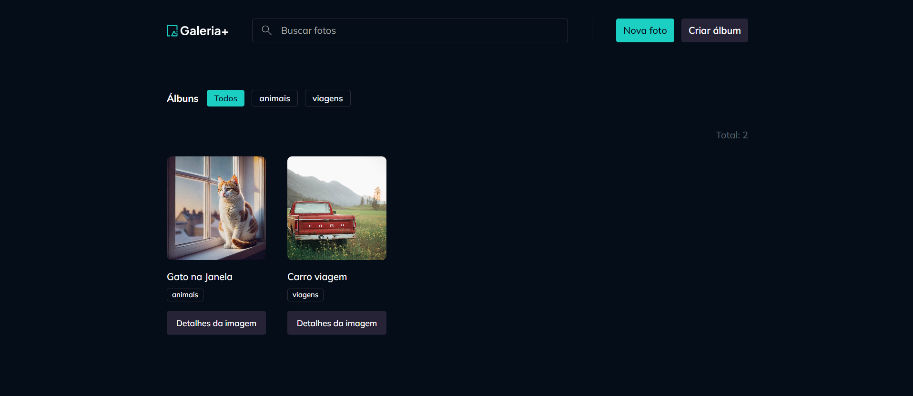

# 📸 Gallery+

Aplicação full-stack de gerenciamento de galeria de fotos. Permite fazer upload de imagens, organizar em álbuns personalizados e filtrar o conteúdo dinamicamente via URL.

🌐 **[Ver deploy](https://frontend-gallery-plus.up.railway.app)**



---

## 🛠️ Tecnologias


**Front-end:** React 19, TypeScript, Vite, Tailwind CSS, TanStack Query, React Router, React Hook Form, Zod, Nuqs, Radix UI, Axios, Sonner

**Back-end:** Fastify 4, TypeScript, Zod, @fastify/multipart, @fastify/static, @fastify/cors, tsup

**Banco de dados:** arquivo JSON local (`data/db.json`) — sem dependências externas.

---

## ✨ Funcionalidades

- 🖼️ **Galeria de fotos** com layout em grid e carregamento otimizado
- 📤 **Upload de imagens** (PNG, JPG, JPEG, até 50MB)
- 📁 **Criação e gerenciamento de álbuns** com associação de fotos
- 🔗 **Filtro por álbum** via URL (compartilhável)
- 🔍 **Busca de fotos** por título
- ⬅️ **Navegação entre fotos** (anterior / próxima) na visualização detalhada
- 🗑️ **Deleção em cascata** — remover uma foto também limpa suas relações com álbuns
- 📱 **Interface responsiva** com notificações e feedbacks visuais

---

## 📂 Estrutura do projeto

```
gallery-plus/
├── src/                        # Front-end (React)
│   ├── components/             # Componentes reutilizáveis
│   ├── contexts/
│   │   ├── photos/             # Lógica, hooks e componentes de fotos
│   │   └── album/              # Lógica, hooks e componentes de álbuns
│   ├── pages/                  # Páginas (home, detalhes, layout)
│   ├── helpers/                # Configuração do Axios e utilitários
│   └── App.tsx
├── server/                     # Back-end (Fastify)
│   ├── main.ts                 # Entrypoint do servidor
│   ├── models.ts               # Interfaces de dados
│   ├── photos/                 # Rotas e serviço de fotos
│   ├── albums/                 # Rotas e serviço de álbuns
│   └── services/               # DatabaseService e manipulação de imagens
├── data/                       # Dados em runtime (gitignore recomendado)
│   ├── db.json                 # Banco de dados JSON
│   └── images/                 # Imagens enviadas
└── public/                     # Assets estáticos
```

---

## 🚀 Como rodar

### Pré-requisitos

- Node.js
- pnpm (`npm install -g pnpm`)

### Instalação

```bash
git clone https://github.com/velosogustavo/gallery-plus.git
cd gallery-plus
pnpm install
```

### Variáveis de ambiente

Crie um arquivo `.env` na raiz com:

```env
VITE_API_URL=http://localhost:5799
VITE_IMAGES_URL=http://localhost:5799/images
```

### Desenvolvimento

Execute os dois comandos em terminais separados:

```bash
# Terminal 1 — back-end
pnpm dev-server

# Terminal 2 — front-end
pnpm dev
```

- Front-end: `http://localhost:5173`
- Back-end: `http://localhost:5799`

### Produção

```bash
pnpm build        # compila front-end + servidor
pnpm run-server   # inicia o servidor compilado
```

---

## 📜 Scripts disponíveis

| Comando | Descrição |
|---|---|
| `pnpm dev` | Inicia o front-end em modo desenvolvimento |
| `pnpm dev-server` | Inicia o back-end em modo desenvolvimento |
| `pnpm build` | Build de produção (front-end + servidor) |
| `pnpm build-server` | Build somente do servidor (tsup) |
| `pnpm run-server` | Executa o servidor compilado |
| `pnpm lint` | Roda o ESLint |

---

## 🔌 API

Base URL: `http://localhost:5799`

### Fotos

| Método | Rota | Descrição |
|---|---|---|
| `GET` | `/photos` | Lista fotos (filtros: `?q=título` `?albumId=uuid`) |
| `GET` | `/photos/:id` | Busca foto por ID (inclui navegação prev/next) |
| `POST` | `/photos` | Cria foto `{ title, albumsIds? }` |
| `POST` | `/photos/:id/image` | Faz upload da imagem (form-data `file`) |
| `PATCH` | `/photos/:id` | Atualiza título `{ title }` |
| `DELETE` | `/photos/:id` | Remove foto e imagem do disco |
| `PUT` | `/photos/:id/albums` | Gerencia álbuns da foto `{ albumsIds }` |

### Álbuns

| Método | Rota | Descrição |
|---|---|---|
| `GET` | `/albums` | Lista álbuns |
| `GET` | `/albums/:id` | Busca álbum por ID |
| `POST` | `/albums` | Cria álbum `{ title }` |
| `DELETE` | `/albums/:id` | Remove álbum |

### Outros

| Método | Rota | Descrição |
|---|---|---|
| `GET` | `/health` | Health check |
| `GET` | `/images/*` | Serve imagens estáticas |

---

## 🗄️ Banco de dados

O projeto usa um arquivo JSON como banco de dados — sem necessidade de instalar ou configurar nenhum serviço externo. O arquivo `data/db.json` e o diretório `data/images/` são criados automaticamente na primeira execução.

```json
{
  "photos": [],
  "albums": [],
  "photosOnAlbums": []
}
```

> ⚠️ Em produção, garanta que o diretório `data/` seja persistente e com permissão de escrita.